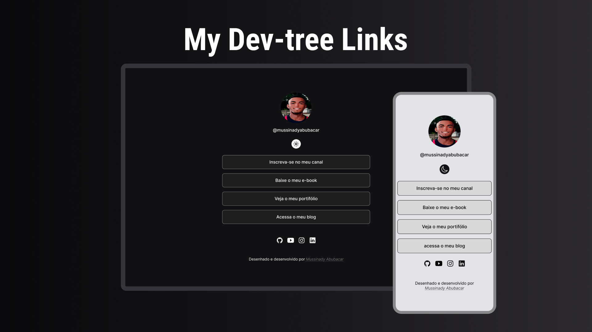

<h1 align="center"> Mydev-Linktree </h1>

Uma pagina simples desenhado e desenvolvido por mim inspirado no design do #dev-link da rocketseat.

  <a href="#-tecnologias">Tecnologias</a>&nbsp;&nbsp;&nbsp;|&nbsp;&nbsp;&nbsp;
  <a href="#-projeto">Projeto</a>&nbsp;&nbsp;&nbsp;|&nbsp;&nbsp;&nbsp;
  <a href="#-layout">Layout</a>&nbsp;&nbsp;&nbsp;|&nbsp;&nbsp;&nbsp;
  <a href="#memo-licença">Licença</a>

  

 

  

## 🚀 Tecnologias

Esse projeto foi desenvolvido com as seguintes tecnologias:

- HTML e CSS
- JavaScript
- Metodologia BEM
- Git e Github
- Figma

## 💻 Projeto

O Mydev-Linktree é um agregador de links para usar como cartão de visitas online nas suas redes socias.

- [Acesse o projeto finalizado, online](https://mussinady-abubacar.github.io/mydev-linktree)

## 🔖 Layout

Você pode visualizar o layout do projeto através [DESSE LINK](https://www.figma.com/file/gNvdaGgwHpezcMv2Y8zfNr/Mydev-LinkTree?type=design&node-id=8%3A264&mode=design&t=BlpbIeB7WSm92LEV-1). É necessário ter conta no [Figma](https://figma.com) para acessá-lo.

## :memo: Licença

Esse projeto está sob a licença MIT.

---

Feito com ♥ por Mussinady Abubacar :wave: [Me siga...!](https://github.com/mussinady-abubacar)

